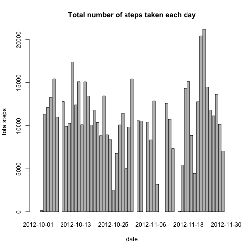
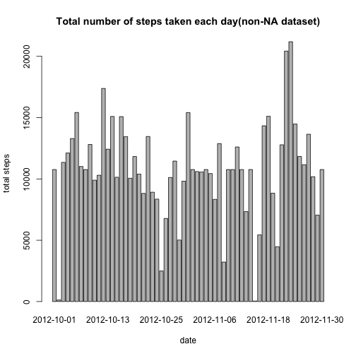
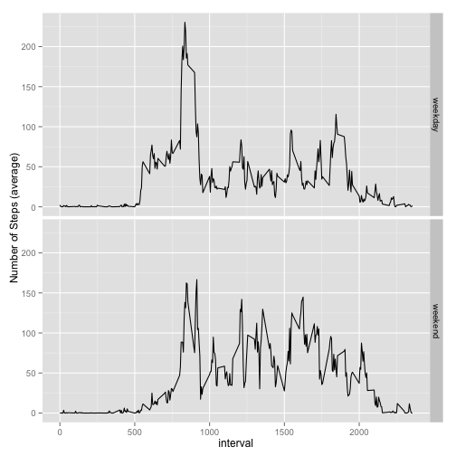

## Loading and processing the data.

Let's load the data and look into the data a little bit.


```r
data1 <- read.csv("activity.csv")
str(data1)
```

```
## 'data.frame':	17568 obs. of  3 variables:
##  $ steps   : int  NA NA NA NA NA NA NA NA NA NA ...
##  $ date    : Factor w/ 61 levels "2012-10-01","2012-10-02",..: 1 1 1 1 1 1 1 1 1 1 ...
##  $ interval: int  0 5 10 15 20 25 30 35 40 45 ...
```


```r
NA.num <- sum(is.na(data1$steps))
```

As above function shows, 2304 NAs exist in the dataset.
  
  
## Calculate the mean total number of steps taken per day.

First, make a histogram(a bar plot actually?) as followed:


```r
##We generate a list of total steps per day.
qu2 <- split(data1$step,data1$date)
##And we calculate the sum of steps for each day.
qu2.2 <- sapply(qu2, sum)
barplot(qu2.2, xlab="date", ylab="total steps", main="Total number of steps taken each day")
```

 

Then we can calculate the mean and median total number of steps taken per day.


```r
qu2.mean <- mean(qu2.2, na.rm = T)
qu2.median <- median(qu2.2, na.rm = T)
```
So, the mean=1.0766 &times; 10<sup>4</sup>, and the median=10765.
  
  
## Let's explore the average daily activity pattern.

As followed:


```r
qu3 <- split(data1$steps, data1$interval)
qu3.mean <- sapply(qu3, mean, na.rm=T)
plot(qu3.mean, xlab="5-minutes interval", ylab="average steps", main="Average steps for each interval across all days", type="l")
```

 
So, as we can see, the maxium of steps is between the 100 and 130 interval.

But which interval exactly? 


```r
which.max(qu3.mean)
```

```
## 835 
## 104
```
The result's format is a little bit strange, but it means that the interval "835"(the 104th interval) contains the maximun steps.
  
  
## The NAs in the dataset

First let's calculate the total number of NAs, using the following function:


```r
sum_NA <- sum(is.na(data1$steps))
```
And we can see there are 2304 NAs.

So what can we do to fill in the NAs? To impute the NAs in a dataset is always tricky, because no matter what we do to replace them, we may introduce bias into the data. For this assignment, I just simply replace all the NAs with the mean for that 5-minute interval. 


```r
## Get an index of the NAs in the dataset.
NA.index <- which(is.na(data1$steps))
int.all <- unique(data1$interval)
## And we use a loop to replace all the NAs with the mean for that 5-minute interval, and name the dataset 'data.new'.
data.new <- data1
for(i in 1:288){
        data.new[NA.index[(data.new[NA.index,3]==int.all[i])],1] <- qu3.mean[i]
}
## Let's take a peek at the transformed dataset.
head(data.new)
```

```
##     steps       date interval
## 1 1.71698 2012-10-01        0
## 2 0.33962 2012-10-01        5
## 3 0.13208 2012-10-01       10
## 4 0.15094 2012-10-01       15
## 5 0.07547 2012-10-01       20
## 6 2.09434 2012-10-01       25
```

So we now make a histogram, and calculate the mean and median of the total number of steps taken per day.


```r
qu2.new <- split(data.new$step,data.new$date)
qu2.2.new <- sapply(qu2.new, sum)
barplot(qu2.2.new, xlab="date", ylab="total steps", main="Total number of steps taken each day(non-NA dataset)")
```

 

As above, imputing the NAs filled the gaps between bars. But whether this is appropriate still needs to be investigated carefully.

The mean and the medium of the imputed data.

```r
mean.new <- mean(qu2.2.new, na.rm = T)
median.new <- median(qu2.2.new, na.rm = T)
```
So the new mean is 1.0766 &times; 10<sup>4</sup>, and teh new median is 1.0766 &times; 10<sup>4</sup>. In this case, we can see that the new mean is the same as the original one, but the median is now equal to the mean (It's obvious since all the NAs are filled with the mean). 
  
  
## Different patterns between weekdays and weekends

First, I use the following to process the dataset.

```r
data.new$days <- weekdays(strptime(data.new$date,"%Y-%m-%d"))
data.new[data.new$days=="星期一",4] <- 'weekday'
data.new[data.new$days=="星期二",4] <- 'weekday'
data.new[data.new$days=="星期三",4] <- 'weekday'
data.new[data.new$days=="星期四",4] <- 'weekday'
data.new[data.new$days=="星期五",4] <- 'weekday'
data.new[data.new$days=="星期六",4] <- 'weekend'
data.new[data.new$days=="星期日",4] <- 'weekend'
head(data.new)
```

```
##     steps       date interval    days
## 1 1.71698 2012-10-01        0 weekday
## 2 0.33962 2012-10-01        5 weekday
## 3 0.13208 2012-10-01       10 weekday
## 4 0.15094 2012-10-01       15 weekday
## 5 0.07547 2012-10-01       20 weekday
## 6 2.09434 2012-10-01       25 weekday
```

So, we've successfully add a new variable into the dataset. We can finally generate the plot by following steps.

```r
weekday.data <- split(data.new, data.new$days)[[1]]
weekend.data <- split(data.new, data.new$days)[[2]]

weekday.list <- split(weekday.data$steps, weekday.data$interval)
weekday.mean <- sapply(weekday.list, mean)

weekend.list <- split(weekend.data$steps, weekend.data$interval)
weekend.mean <- sapply(weekend.list, mean)

weekday.mean <- data.frame(Mean=sapply(weekday.list, mean), days='weekday')
weekend.mean <- data.frame(Mean=sapply(weekend.list, mean), days='weekend')

all.data <- rbind(weekday.mean, weekend.mean)
all.data$interval <- row.names(weekend.mean)

all.data$interval <- as.numeric(all.data$interval)
library(ggplot2)
qplot(interval, Mean, data=all.data, facets = days~.,geom="line",group=1,ylab="Number of Steps (average)")
```

 


